# Figure Fields | Guide

Figures are contained and displayed inside of Modals (Modal windows that open on top of scenes). There are four figure types (Internal Image, External Image, Interactive, and Code). On the visitor side of the site, inside of a Modal window and a tab inside of the Modal, you can stack these figures on top of each other to your heart's content. 

Hierarchy: **Instance Type → Instances → Scenes → Modals → Figures (We are Here)**.

Every figure must belong to an Instance, Scene, and Modal. Without these, you cannot create a figure that site visitors that will be able to see. Figures cannot be displayed on the visitor side of the site unless they are published and the Scene and Modal associated with them are also published.

**When Finished Making Field Selections:  Press "SAVE" in the top right of the page.**

&nbsp;
---
&nbsp;
## Fields Covered:
- [Figure Title (Top of Page)](#figure-title-top-of-page)
- [Status](#status)
- [Instance](#instance)
- [Scene](#scene)
- [Icon](#icon)
- [Tab](#tab)
- [Order](#order)
- [Monitoring Program Link](#monitoring-program-link)
- [Data Link](#data-link)
- [Figure Type](#figure-type)
- [Figure Title](#figure-title)
- [Short Figure Caption](#short-figure-caption)
- [Extended Caption](#extended-caption)
- [Preview Figure](#preview-figure)

&nbsp;
---
&nbsp;
## Figure Title (Top of Page)
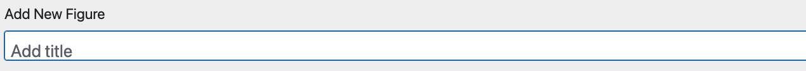

**What it does:** This is the title for the figure on the Graphic Data admin side. The "Figure Title" below is the one that people will actually see.

**When to use:** Always set this before publishing; It will help you find the figure later on the admin side.

**Required?** Yes.

&nbsp;
---
&nbsp;
## Status
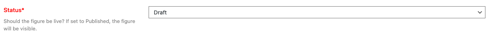

**What it does:** Controls whether the figure is visible to the public or still being edited.

**When to use:** Always set this before publishing; switch back to Draft if you need to hide a figure temporarily.

**Required?** Required for publishing (set to **Published**).

**Options & examples:**
- **Draft** — Hidden from public. Safe place to work-in-progress.
- **Published** — Publicly visible. Only publish after verifying content and preview.

**Tips:**
- Use **Draft** while you gather files/links or wait on approvals.
- Do a final **Preview** before switching to **Published**.

&nbsp;
---
&nbsp;
## Instance
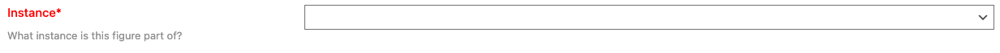

**What it does:** Assigns the figure to a top-level site area (e.g., a program or project space).

**When to use:** Always select the Instance the figure belongs to so it appears in the right place.

**Required?** Yes — figures must belong to one Instance.

**Options & examples:**
- Choose the Instance from the dropdown list (e.g., *CETACEAN, CINMS, SBNMS*).

**Tips:**
- If you don’t see the right Instance, check your permissions or verify the Instance exists.

&nbsp;
---
&nbsp;
## Scene
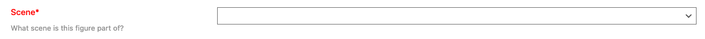

**What it does:** Places the figure into a specific Scene within the selected Instance (a theme or location).

**When to use:** When you want figures grouped by topic, geography, or workflow inside an Instance.

**Required?** Yes — each figure must belong to one Scene.

**Options & examples:**
- Pick the Scene that matches the figure’s topic/location.

**Tips:**
- Changing the **Instance** will change which **Scenes** are available. Re-check this if you switch Instances.

&nbsp;
---
&nbsp;
## Icon
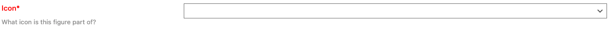

**What it does:** Chooses the icon group where the figure appears inside the Scene (used in modals/navigation).

**When to use:** When your Scene uses icons to organize related figures (e.g., Monitoring, Data, Methods).

**Required?** Usually yes — depends on Scene setup.

**Options & examples:**
- Select an icon category from the dropdown to place your figure with related items.

**Tips:**
- Think of Icons as folders inside a Scene. Pick the one where users will expect to find your figure.

&nbsp;
---
&nbsp;
## Tab
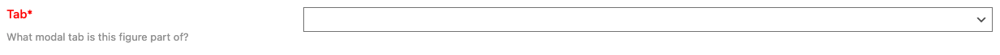

**What it does:** Groups figures within the same icon into tabs inside the modal.

**When to use:** When the icon contains multiple figures and you want to separate them by topic/type.

**Required?** Optional — but recommended when an icon has multiple figures.

**Options & examples:**
- Choose an existing tab (e.g., *Overview*, *Details*, *Data*), or the default if there’s just one.

**Tips:**
- Keep tab names short and user-friendly (1–2 words).

&nbsp;
---
&nbsp;
## Order
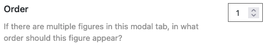

**What it does:** Sets the display order of figures that share the same icon and tab.

**When to use:** When multiple figures are in the same tab — the lower the number, the earlier it appears.

**Required?** Optional — only matters when there’s more than one figure in a tab.

**Options & examples:**
- Use whole numbers: **1, 2, 3…**

**Tips:**
- Leave gaps (e.g., 10, 20, 30) so you can insert items later without renumbering everything.

&nbsp;
---
&nbsp;
## Monitoring Program Link
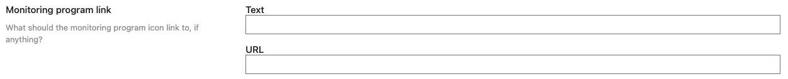

**What it does:** Adds a link to a related monitoring program (shows as a link/icon near the figure).

**When to use:** When a figure is part of or sourced from a specific monitoring program.

**Required?** Optional — leave blank if not applicable.

**Options & examples:**
- **Text** — The label shown to users (e.g., *Learn more*).
- **URL** — The full link (e.g., `https://example.org/program`).

**Tips:**
- Use clear labels (e.g., *Program overview*, *Method details*).
- Always test the link after saving.

&nbsp;
---
&nbsp;
## Data Link
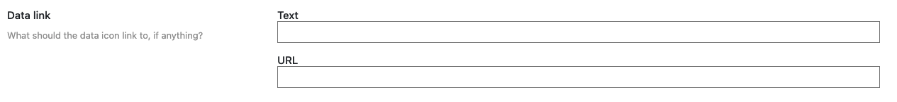
**What it does:** Provides a direct link to the dataset or a downloadable file (e.g., CSV, JSON, GeoJSON).

**When to use:** When users should be able to access the underlying data behind the figure.

**Required?** Optional — highly recommended for transparency and reuse.

**Options & examples:**
- **Text** — e.g., *Download CSV*, *Open dataset*.
- **URL** — e.g., a public data portal or file location.

**Tips:**
- Make sure the link is public and stable (avoid temporary links).
- If the dataset updates regularly, consider noting the refresh cadence in the caption.

&nbsp;
---
&nbsp;
## Figure Type
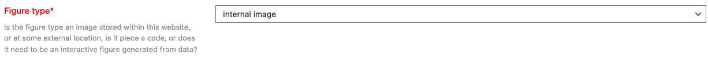

[Click here to see the in-depth guide for Internal Images, External Images, & Code](figure_types.md)

[Click here to see the in-depth guide Interactive Figures](figures_interactive.md)

**What it does:** Decides how your figure content is provided and rendered.

**When to use:** Always — this controls which inputs appear (image upload, external URL, interactive data, or code).

**Required?** Yes — choose one.

**Options & examples:**
- **Internal image** — Upload to the media library (recommended for static figures).
- **External image** — Paste a public image URL (ensure it won’t break or change).
- **Interactive** — Use a data file (CSV/JSON/GeoJSON) to render a Plotly figure.
- **Code** — Embed custom HTML/JavaScript (advanced users).

**Tips:**
- Pick **Internal image** for long-term reliability (files live with the site).
- For **Interactive**, confirm the data file loads and the chart renders in **Preview**.
- Use **Code** only if you understand the security and maintenance implications.

&nbsp;
---
&nbsp;
## Figure Title
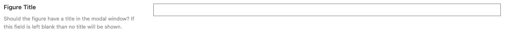

**What it does:** Displays a title above the figure inside its modal.

**When to use:** When the figure needs a clear label or you expect to link directly to it.

**Required?** Optional — recommended for clarity.

**Options & examples:**
- Short, descriptive titles work best (e.g., *Monthly SST Anomalies, 2020–2025*).

**Tips:**
- Avoid repeating the Scene/Tab name — keep the title unique to the figure.

&nbsp;
---
&nbsp;
## Short Figure Caption
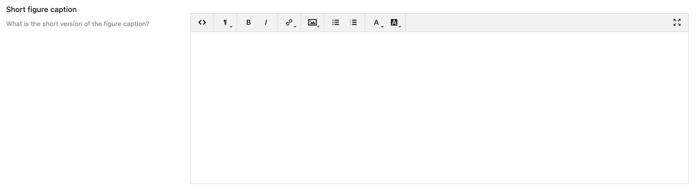

**What it does:** A brief 1–2 sentence caption displayed beneath the figure.

**When to use:** Always — helps users understand what they’re seeing.

**Required?** Optional — recommended.

**Tips:**
- Focus on the key message and timeframe.
- Avoid jargon; link to **Data Link** or **Extended Caption** for details.

&nbsp;
---
&nbsp;
## Extended Caption
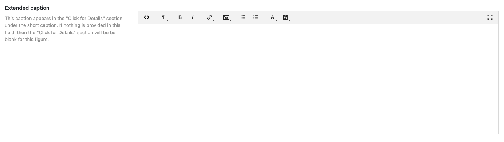

**What it does:** A longer description shown when users click *Click for Details*.

**When to use:** Use for methods, caveats, interpretation notes, and citation/credit lines.

**Required?** Optional — recommended for scientific transparency.

**Tips:**
- Include data sources, processing steps, and contact info if appropriate.
- Use short paragraphs or bullet lists for readability.

&nbsp;
---
&nbsp;
## Preview Figure

**What it does:** Shows how the figure will look to users (including tabs, captions, and links).

**When to use:** Before publishing and whenever you change **Figure Type**, data, or captions.

**Required?** Not a field, but essential for quality checks.

**Tips:**
- Verify the chart renders, images load, and all links work.
- Check on both desktop and mobile layouts if possible.
