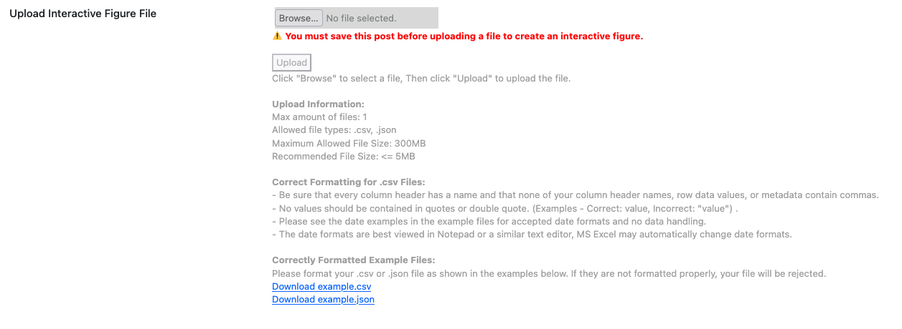
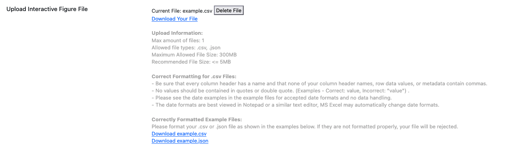
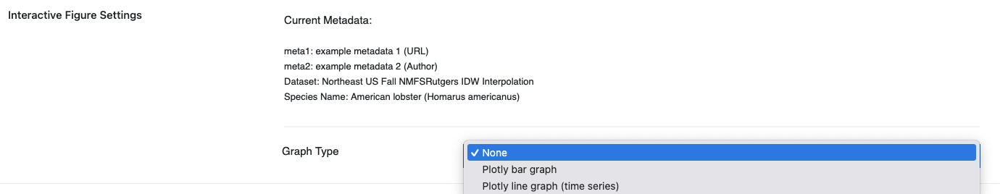
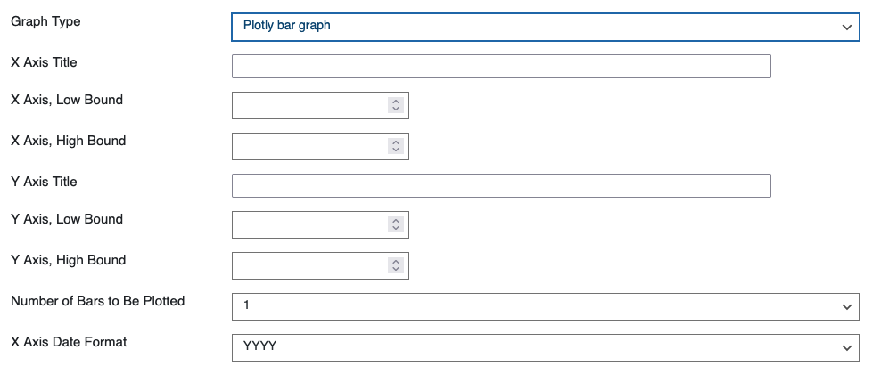
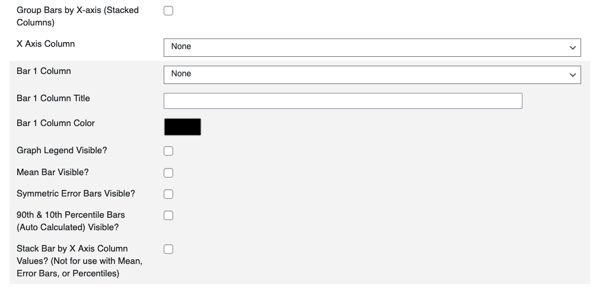
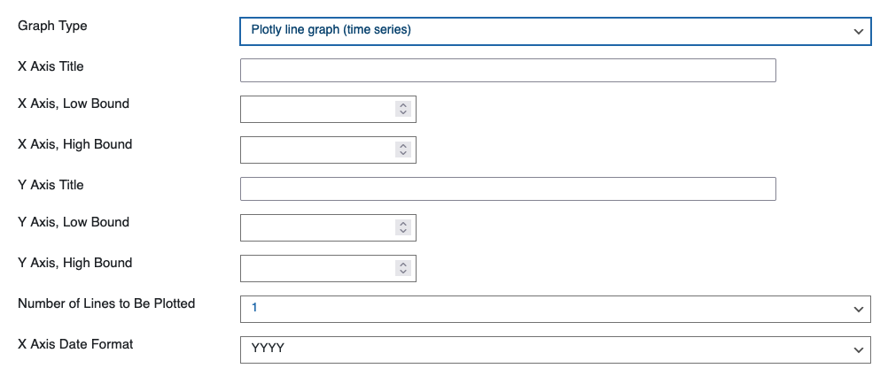
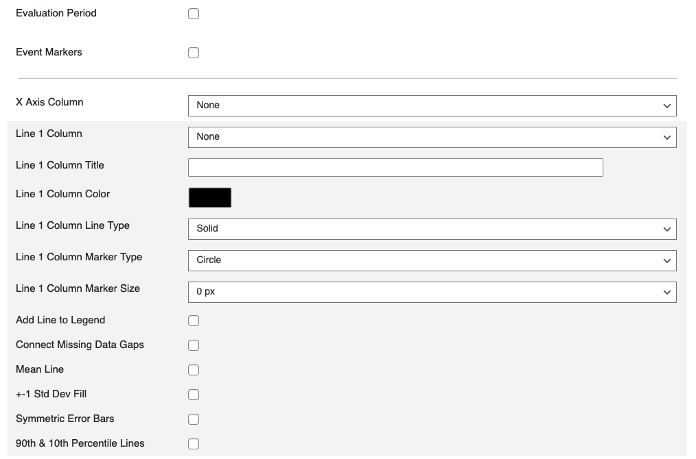

# Interactive Figures | Guide

An in-depth guide for how to create Interactive figures. Currently, there are two types of Interactive Figures offered by Graphic Data. Currently, there are two types: **Bar Charts** and **Time Series**.

**When Finished Making Field Selections:  Press "SAVE" in the top right of the page.**

&nbsp;
---
&nbsp;
## Fields Covered:
- [Workflow Checklist](#workflow-checklist)
- [Graph Type](#graph-type)
- [File Upload](#file-upload)
- [New Upload](#new-upload)
- [Existing Upload](#existing-upload)
- [Time Series Line Charts](#time-series)
- [Barcharts](#bar-charts)
- [Best Practices](#best-practices)

&nbsp;
---
&nbsp;
## Workflow Checklist
1. Save the post first.  
2. Upload your CSV/JSON file.  
   - Example files: [Sample CSV](https://github.com/ioos/sanctuarywatch_graphicdata/blob/main/plugins/graphic_data_plugin/example_files/example.csv), [Sample JSON](https://github.com/ioos/sanctuarywatch_graphicdata/blob/main/plugins/graphic_data_plugin/example_files/example.json)  
3. Configure axes (titles, bounds).  
4. Choose number of bars or lines.  
5. Adjust style (markers, error bars, colors).  
6. Preview before publishing.  

⚠️ **Important:** You must save the post before uploading a file.  

&nbsp;
---
&nbsp;
## File Upload

### New Upload
  
> Screenshot: Uploading a new CSV/JSON file.

### Existing Upload
  
> Screenshot: Selecting an already uploaded CSV/JSON file.

**Steps:**  
1. Save your post.  
2. Use the upload field to select or add a CSV/JSON file.  
3. Once uploaded, additional chart configuration fields appear.  

💡 **Tip:** CSVs should have clear headers (e.g., `date`, `value`). Dates should be in `YYYY-MM-DD` format.

&nbsp;
---
&nbsp;
## Graph Type
  
> Screenshot: Select the type of graph you would like to create.

**Bar Charts** or **Time Series**.

&nbsp;
---
&nbsp;
## Bar Charts
  
> Screenshot: Bar chart configuration panel.

  
> Screenshot: Bar chart configuration panel.

**What it does:** Creates a bar chart from uploaded data.

**When to use:** For categorical comparisons (e.g., values per category).  

**Required:** Data file, X axis column, Y axis column.  

**Steps:**  
1. Choose **Graph Type → Bar Chart**.  
2. Map your CSV columns: one for X axis (categories), one for Y axis (values).  
3. Set X and Y axis titles.  
4. Adjust bounds if needed (e.g., set Y axis minimum to 0).  
5. Enter the **number of bars** to display.  

**Options:**  
- Axis bounds (low/high).  
- Bar grouping/stacking options.  

💡 **Tips:**  
- Keep category names short.  
- If bars overlap, reduce the number of bars or adjust group spacing.  

&nbsp;
---
&nbsp;
## Time Series
  
> Screenshot: Time series configuration panel.

  
> Screenshot: Line and marker options for time series.

**What it does:** Plots data values over time. 

**When to use:** For continuous measurements (e.g., monthly temperature). 

**Required:** Data file with a date/time column for X axis and one or more numeric columns for Y axis.  

**Steps:**  
1. Choose **Graph Type → Time Series**.  
2. Map X axis to the date column.  
3. Map Y axis to one or more numeric columns.  
4. Set axis titles and bounds.  
5. Choose **number of lines** to plot.  
6. Configure line/marker style: shape, size, and color.  
7. Add overlays if needed: mean line, ±1 standard deviation, error bars, percentile bands.  
8. Set evaluation period shading if required.  

**Options:**  
- Number of lines.  
- Marker customization.  
- Error bars.  
- Evaluation period (start/end).  

💡 **Tips:**  
- Use consistent date formats (`YYYY-MM-DD`).  
- Always preview to check for gaps in data.  
- Keep legends clear by naming your columns well.  

&nbsp;
---
&nbsp;
## Best Practices
- Keep files small (<2 MB) though you can upload up to (300 MB).  
- Use descriptive column names (`date`, `value`, `series`).  
- Always preview before publishing to confirm layout and data correctness.  

