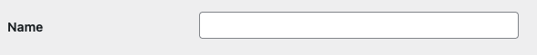
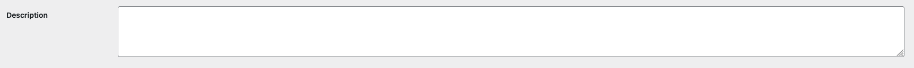
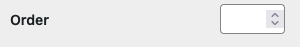
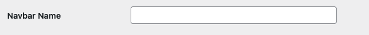
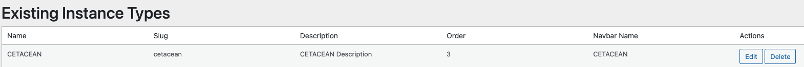

# Instance Types | Guide

Instance Types define categories of Instances. Instances Types are the highest level of organization on Graphic Data and define the types of Instances you can add to the front page of your website. This of this as a way to organize the buttons on the front page of your website that will represent Instances. Each Instance Type groups related Instances for navigation and organization.

Hierarchy: **Instance Type (We are Here) → Instance → Scene → Modals → Figures**.

**When Finished Making Field Selections:  Press "SAVE" in the top right of the page.**

&nbsp;
---
&nbsp;
## Fields Covered:
- [Name](#name)
- [Slug](#slug)
- [Description](#description)
- [Order](#order)
- [Navbar Name](#navbar-name)
- [Existing Instance Types](#existing-instance-types)
- [Final Checklist Before Publishing](#-final-checklist-before-publishing)

&nbsp;
---
&nbsp;
## Name

> Screenshot: Entering the Instance Type name.

**What it does:** Human-friendly label for the Instance Type.

**Required?** Yes. 

💡 Use clear, short names (e.g., *CETACEAN*).

&nbsp;
---
&nbsp;
## Slug

> Screenshot: Setting the slug.

**What it does:** URL-friendly version of the name.

**Required?** Yes.

⚠️ Must be unique, lowercase, no spaces (use dashes). 

💡 Example: `sanctuary-watch`.

&nbsp;
---
&nbsp;
## Description

> Screenshot: Entering description.

**What it does:** Longer text describing the Instance Type.

**Required?** Optional. 

💡 Helpful for editors to know purpose.

&nbsp;
---
&nbsp;
## Order

> Screenshot: Setting display order.

**What it does:** Controls the display order of Instance Types. If the order is set to "1", then that will be the first Instance Type at the top of the front page of your website. If the order is set to "2", then the Instance Type will display below the Instance Type that is set to "1", and so on. 

**Required?** Yes.  

&nbsp;
---
&nbsp;
## Navbar Name
 

> Screenshot: Navbar name field.

**What it does:** How the type appears in navigation menus.

**Required?** Yes.  
💡 Keep names short to avoid wrapping.

&nbsp;
---
&nbsp;
## Existing Instance Types
 

> Screenshot: List of saved Instance Types.

**What it does:** Displays current Instance Types in a table.

**Columns:**  
- Name — The label.  
- Slug — URL identifier.  
- Description — Details.  
- Order — Position.  
- Navbar Name — Menu label.  

**Actions:**  
- **Edit** — Opens form with fields pre-filled.  
- **Delete** — Permanently removes Instance Type.  

⚠️ **Note:** Deleting cannot be undone. 

💡 Always double-check before deleting. 

&nbsp;
---
&nbsp;
## ✅ Final Checklist Before Publishing

- Name is clear and human-friendly.  
- Slug is lowercase, unique, no spaces.  
- Description filled if useful.  
- Order number fits sequence (leave gaps).  
- Navbar Name matches intended label.  
