# Instance Fields | Guide

Instances are the second highest level of organization on Graphic Data. Each Instance represents a program or project space and contains Scenes (Scenes operate on .svg files). It is important to note that instances link directly to a single Scene, but can contain many Scenes. The overview scene (a field listed below) is the scene that your site visitors will see after they click a button to access your instance. 

Hierarchy: **Instance Type → Instances (We are Here) → Scenes → Modals → Figures**.

Instances cannot be displayed on the visitor side of the site unless they are published.

**When Finished Making Field Selections:  Press "SAVE" in the top right of the page.**

&nbsp;
## Fields Covered:
- [Instance Title](#instance-title)
- [Short Title](#short-title)
- [URL Component](#url-component)
- [Instance Type](#instance-type)
- [Overview Scene](#overview-scene)
- [Status](#status)
- [Tile Image](#tile-image)
- [Legacy Content](#legacy-content)
- [Tile Background Color](#tile-background-color)
- [Tile Text Color](#tile-text-color)
- [Number of Footer Columns](#number-of-footer-columns)

&nbsp;
## Instance Title
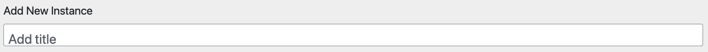

> Screenshot: Instance title field.

**What it does:** Tells the admin and your site visitors the title of the Instance.

**Required?** Yes.  

💡 Keep under 40 characters or a few words for best display.

&nbsp;
## Short Title

> Screenshot: Short title field.

**What it does:** A short name for the Instance, used in menus.

**Required?** Yes.  

💡 Keep under 20 characters for best display.

&nbsp;
## URL Component
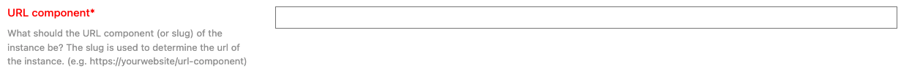  

> Screenshot: URL slug.

**What it does:** Sets the URL path for the Instance.

**Required?** Yes.

⚠️ Must be unique, no spaces. Use dashes (e.g., `my-instance`).

&nbsp;
## Instance Type
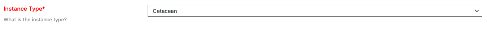

> Screenshot: Selecting Instance type.

**What it does:** Defines the type of Instance (e.g., program, sanctuary). 

**Required?** Yes.

&nbsp;
## Overview Scene
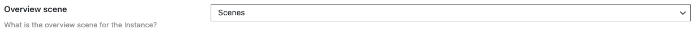 

> Screenshot: Choosing overview Scene.

**What it does:** Sets which Scene is the overview for this Instance. It is important to note that instances link directly to a single Scene (The Overview Scene), but can contain many Scenes. The Overview Scene is the scene that your site visitors will see after they click a button to access your instance. 

**When to use:** Always designate one Scene.

**Required?** Yes. You may have create the scene for this field after you create and save your instance. If the Scene doesn't already exist, this field can seem confusing. 

&nbsp;
## Status
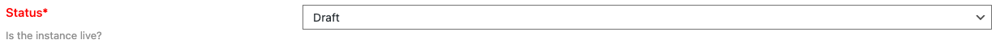  

> Screenshot: Status dropdown.

**What it does:** Controls visibility (Draft or Published). 

- Draft = Hidden from site visitors. 

- Published = Visible to site visitors.

**Required?** Yes.  

&nbsp;
## Tile Image
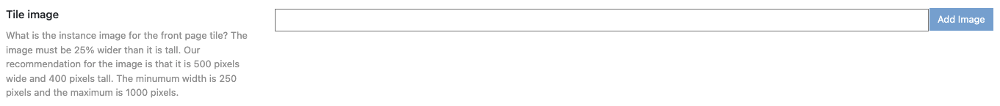  

> Screenshot: Tile image field.

**What it does:** Image shown on the Instance selection tile.

**Required?** Optional, but the front of the website will look weird and empty if you don't input this option.

⚠️ The image must be 25% wider than it is tall. Our recommendation for the image is that it is 500 pixels wide and 400 pixels tall. The minimum width is 250 pixels and the maximum is 1000 pixels.

💡 Optimize for web (<1MB) and .png is best.

&nbsp;
## Legacy Content
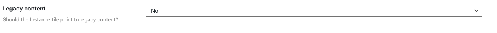  

> Screenshot: Legacy content field.

**What it does:** If set to "Yes", when users click on the button to access this Instance, instead of it sending users to the overview scene, you can make it send to a different website or different page from a legacy website. Is set to "No", the button will direct site visitors to the Overview Scene. 

**Required?** Optional.

**Legacy Content: If set to Yes**

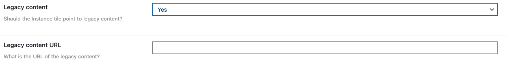  

&nbsp;
## Tile Background Color
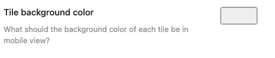
 
> Screenshot: Tile background color picker.

**What it does:** Sets background color of each Modal button in mobile view.

**Required?** Optional.

⚠️ Effects mobile view only!

&nbsp;
## Tile Text Color
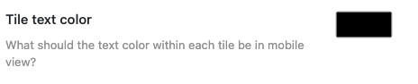

> Screenshot: Tile text color picker.

**What it does:** Sets text color of each Modal button in mobile view.

**Required?** Optional.

⚠️ Effects mobile view only! Ensure contrast for readability. Effects mobile view only!

&nbsp;
## Number of Footer Columns
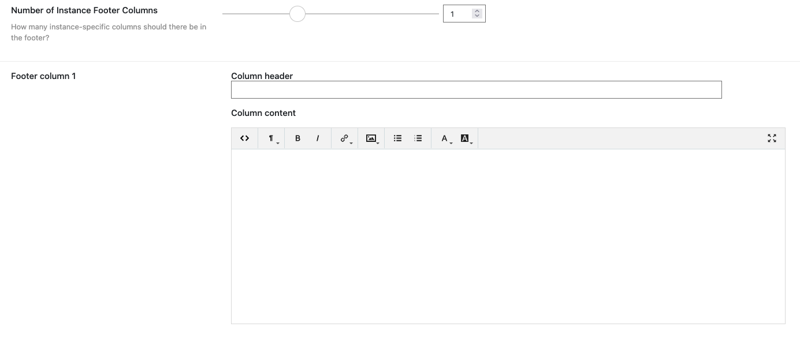

> Screenshot: Footer column selection.

**What it does:** Defines how many columns the footer has. Be sure to add titles to your footer sections, then you can add content.

**Options:** 1, 2, or 3. 

**Required?** Optional but needed for any serious website.  
