# Modal Fields | Guide

Modals are windows that open up on top of "Scenes". They contain the figures you create. You can think of Modals as what the icons in your .svg file (In the scene) are linked to. Or, as the container for the figures you will create. The figures in Modals are displayed inside of tabs in the Modal. 

Hierarchy: **Instance Type → Instances → Scenes → Modals (We are Here) → Figures**.

Every modal must belong to an Instance and a Scene. Without these, you cannot create a modal that site visitors that will be able to see. Modals cannot be displayed on the visitor side of the site unless they are published and the Instance and Scene associated with them are also published.

**When Finished Making Field Selections:  Press "SAVE" in the top right of the page.**

 &nbsp;
## Fields Covered:
- [Modal Title](#modal-title)
- [Modal Status](#modal-status)
- [Instance](#instance)
- [Scene](#scene)
- [Icons](#icons)
- [Icon Order](#icon-order)
- [Icon Action](#icon-action)
- [Modal Tagline](#modal-tagline)
- [Number of Modal Info Entries](#number-of-modal-info-entries)
- [Number of Modal Photo Entries](#number-of-modal-photo-entries)
- [Number of Modal Tabs](#number-of-modal-tabs)
- [Modal Tab Title](#modal-tab-title)
- [Preview Modal](#preview-modal)

&nbsp;
## Modal Title
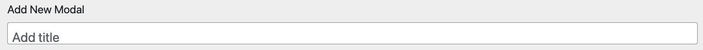

**What it does:** Controls what is displayed on the visitor side as the title of the modal.

**When to use:** Always set this before publishing.

**Required?** Yes.

&nbsp;
## Modal Status
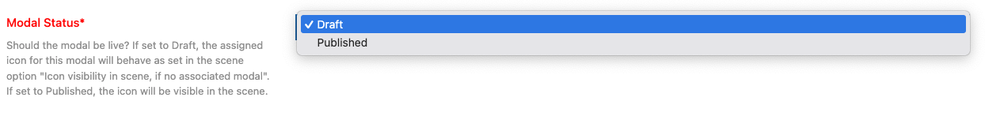

**What it does:** Controls whether the modal is live or hidden.

**When to use:** Always set this before publishing.

**Required?** Yes.

**Options & examples:**
- **Draft** — Modal is hidden. The associated icon will follow Scene’s visibility rules if no modal is attached.
- **Published** — Modal and icon will be visible.

**Tips:**
- Keep in Draft until all fields are configured.
- Preview before switching to Published.

&nbsp;
## Instance
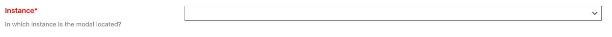

**What it does:** Assigns the modal to a top-level Instance (project or program area).

**When to use:** Always select the Instance for the modal.

**Required?** Yes.

**Options & examples:**
- Choose the Instance from the dropdown.

**Tips:**
- Changing the Instance changes which Scenes and Icons are available.

&nbsp;
## Scene
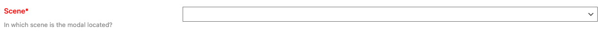

**What it does:** Places the modal in a specific Scene within the Instance.

**When to use:** When you want to group modals under a Scene.

**Required?** Yes.

**Options & examples:**
- Select the Scene from the dropdown.

**Tips:**
- Be consistent in Scene usage across figures and modals.

&nbsp;
## Icons
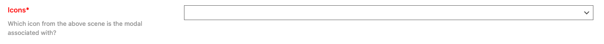

**What it does:** Connects the modal with an icon inside the Scene.

**When to use:** Always — a modal needs an icon to appear.

**Required?** Yes.

**Options & examples:**
- Pick the icon that should open this modal.

**Tips:**
- Each modal corresponds to one icon.

&nbsp;
## Icon Order
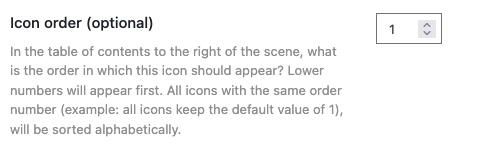

**What it does:** Controls the order icons appear in the Scene’s table of contents.

**When to use:** When multiple icons are in a Scene.

**Required?** Optional.

**Options & examples:**
- Enter a number (1, 2, 3…). Lower numbers appear earlier.
- Icons with the same order number are sorted alphabetically.

&nbsp;
## Icon Action
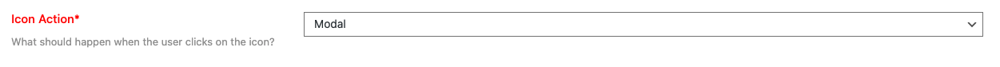

**What it does:** Specifies what happens when a user clicks the icon.

**When to use:** Always.

**Required?** Yes.

**Options & examples:**
- **Modal** — Opens this modal asa window on top of the scene.
- **Scene** — Opens this modal icon to another scene instead (a thematic scene).

&nbsp;
## Modal Tagline
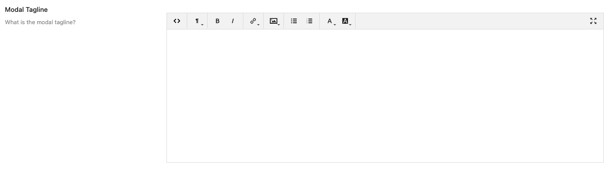

**What it does:** Optional text displayed at the top of the modal window.

**When to use:** When you want to provide a subtitle or context.

**Required?** Optional.

**Options & examples:**
- Enter text (supports formatting).

**Tips:**
- Keep it short and user-friendly.

&nbsp;
## Number of Modal Info Entries
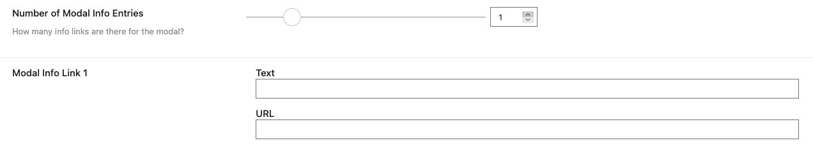

**What it does:** Defines how many external link entries (Up to 6) appear in the "More Info" accordion menu on the Modal. Enter the "Text" as you want the link to appear and the "URL" for the actual page you want to link out to.

**When to use:** When adding references, external links, or supporting notes.

**Required?** Optional.

**Options & examples:**
- Choose a number (each entry adds a link field).

**Tips:**
- Start small; you can always increase later.

&nbsp;
## Number of Modal Photo Entries
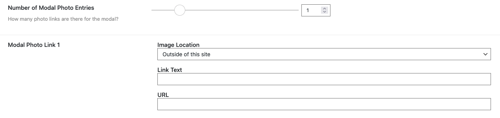

**What it does:** Defines how many photo ink entries (Up to 6) appear in the "Photos" accordion menu on the Modal. Enter the "Text" as you want the link to appear and the "URL" for the actual page you want to link out to.

**When to use:** When adding supporting images inside the modal. When you want to have a "Photos" accordion menu appear below the "More Info" accordion menu in your Modal that contains external links to photos.

**Required?** Optional.

**Image Location:** 

- If the image is "Within this site" of the your site use this option. Enter the "Link Text" as you want the link to appear on the visitor side and select your image using the media selector tool.

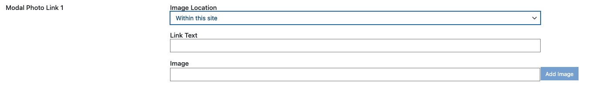

- If the image is "Outside of this site" of the your site use this option. Enter the "Link Text" as you want the link to appear on the visitor side and the "URL" for the actual page you want to link out to.

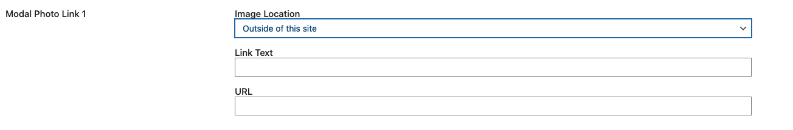  

**Tips:**
- Use only high-quality, relevant images.

&nbsp;
## Number of Modal Tabs
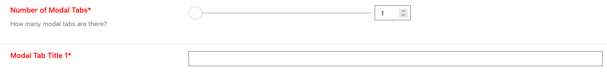

**What it does:** Controls how many tabs exist inside the modal.

**When to use:** When you want to organize modal content (Figures) into multiple sections.

**Required?** Yes — at least one tab is required.

**Options & examples:**
- Use the slider to select the number of tabs.

**Tips:**
- Each tab will require a title.

&nbsp;
## Modal Tab Title
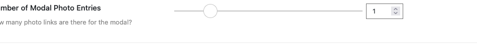

**What it does:** Sets the title for each modal tab.

**When to use:** When you have multiple tabs.

**Required?** Yes — one per tab.

**Options & examples:**
- Enter a short, descriptive name.

**Tips:**
- Keep tab names concise and unique.

&nbsp;
## Preview Modal
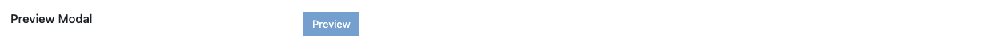

**What it does:** Shows how the modal will appear to users.

**When to use:** Before publishing.

**Required?** Not a field, but essential for quality control.

**Tips:**
- Verify layout, captions, links, and tab organization.
- Check both desktop and mobile.
