# Scene Fields | Guide

Scenes are pages that utilize .svg files to display content, where the icons in a .svg are the interactive component that link to either other Scenes or Modals. When hovering a mouse over the icons in a .svg that is in a scene, if linked correctly to a modal, that icon will highlight with a color of your selection. If in mobile view, the icons in a .svg will turn into buttons.

Please see our guide for creating an .svg file for use with Scenes in Graphic Data.

Hierarchy: **Instance Type → Instances → Scenes (We are Here) → Modals → Figures**.

Every scene must belong to an Instance and acts as the first stage for displaying content. Scenes cannot be displayed on the visitor side of the site unless they are published and the Instance associated with them is also published. 

**There are two types of Scenes:**

 - **Overview Scene:** Overview Scenes are the "landing page" or first scene that you encounter after clicking on an instance.

 - **Thematic Scene:** Thematic Scenes are scenes that can be accessed after being linked to icons (Modals) in your Overview Scene. In other words, you have your overview scene and you can link to a thematic scene from an overview scene.

 **When Finished Making Field Selections:  Press "SAVE" in the top right of the page.**

&nbsp;
---
&nbsp;
## Fields Covered:
- [Scene Title](#scene-title)
- [Scene Status](#scene-status)
- [Instance](#instance)
- [Infographic (SVG Upload)](#infographic-svg-upload)
- [Tagline](#tagline)
- [Number of Info Entries](#number-of-info-entries)
- [Number of Photo Entries](#number-of-photo-entries)
- [Order](#order)
- [Full Screen Button](#full-screen-button)
- [Text Toggle](#text-toggle)
- [Icon Visibility](#icon-visibility)
- [Table of Contents Style](#table-of-contents-style)
- [Preview Scene](#preview-scene)

&nbsp;
---
&nbsp;
## Scene Title
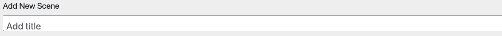

> Screenshot: Set the title for the Scene.

**What it does:** Names the Scene and Displays on the site visitor side end and the admin side with this name.  

**When to use:** Always.

**Required?** Yes.

&nbsp;
---
&nbsp;
## Scene Status
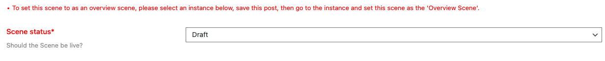

> Screenshot: Choosing Draft or Published status.

**What it does:** Controls whether the Scene is visible or hidden.  

**When to use:** Draft for work-in-progress, Published for live and available to site visitors.

**Required?** Yes.

⚠️ Figures inside a Scene set to "Draft" are not visible to site visitors or admins on the site visitor side when logged in.

&nbsp;
---
&nbsp;
## Instance
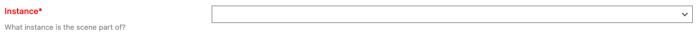

> Screenshot: Selecting the parent Instance.

**What it does:** Assigns the Scene to an Instance. 

**When to use:** Always.

**Required?** Yes.

💡 Changing the Instance may change which Figures/Modals are available.

&nbsp;
---
&nbsp;
## Infographic (SVG Upload)
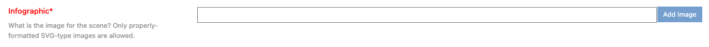

> Screenshot: Uploading the Scene infographic.

Please see our guide for creating an .svg file for use with Scenes in Graphic Data.
[Click here to see the guide](../creating_svg_files/creating_svg_files.md)

**What it does:** Displays a Scene infographic.  

**Required?** Yes.

⚠️ File must be SVG.

&nbsp;
---
&nbsp;
## Tagline
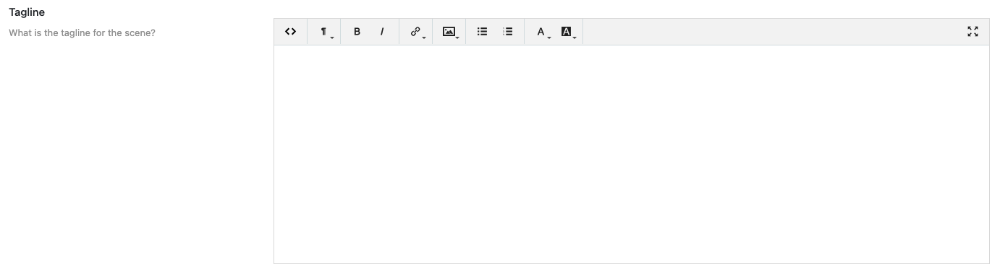

> Screenshot: Entering a tagline.

**What it does:** Short descriptive text shown under the Scene title.  

**Required?** Optional.

💡 Keep it under a small paragraph of 5 or 6 sentences.

&nbsp;
---
&nbsp;
## Number of Info Entries
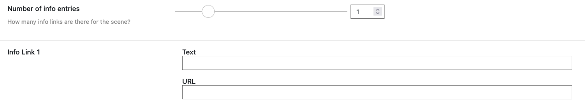

> Screenshot: Setting number of info entries.

**What it does:** Defines how many external link entries (Up to 6) appear in the "More Info" accordion menu on the Scene. Enter the "Text" as you want the link to appear and the "URL" for the actual page you want to link out to.

**When to use:** When you want to have a "More Info" accordion menu appear to the top right of your Scene that contains external links that provide more Information.

**Required?** Optional.

&nbsp;
---
&nbsp;
## Number of Photo Entries

> Screenshot: Setting number of photo entries.

**What it does:** Defines how many photo ink entries (Up to 6) appear in the "Photos" accordion menu on the Scene. Enter the "Text" as you want the link to appear and the "URL" for the actual page you want to link out to.

**When to use:** When you want to have a "Photos" accordion menu appear below the "More Info" accordion menu on the top right of your Scene that contains external links to photos.

**Required?** Optional.

**Image Location:** 

- If the image is "Within this site" of the your site use this option. Enter the "Link Text" as you want the link to appear on the visitor side and select your image using the media selector tool.

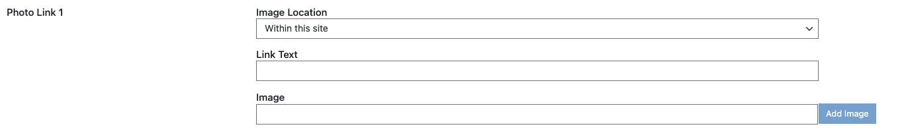

- If the image is "Outside of this site" of the your site use this option. Enter the "Link Text" as you want the link to appear on the visitor side and the "URL" for the actual page you want to link out to.

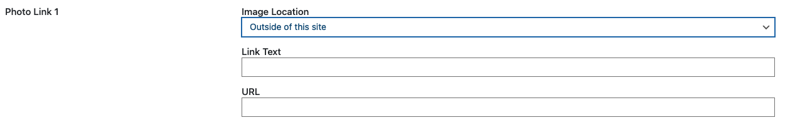  

&nbsp;
---
&nbsp;
## Order
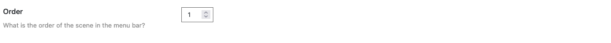  

> Screenshot: Entering Scene order.

**What it does:** Sets Scene display order inside an Instance. Your "Overview Scene" should be set to "1". "Thematic Scenes" should be set to numbers greater than 1.

**Required?** Optional.

&nbsp;
---
&nbsp;
## Full Screen Button
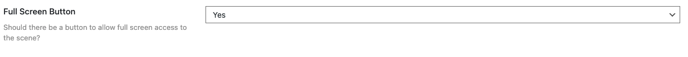 

> Screenshot: Full screen button option.

**What it does:** Adds a button on the actual .svg file in your scene on the visitor side, so they have the option view the scene in full screen mode.

**When to use:** This is great ADA feature to help people appreciate the artwork in your scene! It also helps site visitors see the scene in-depth if they would like to do so.

**Required?** Optional.

&nbsp;
---
&nbsp;
## Text Toggle
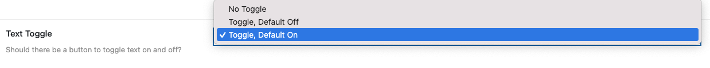

> Screenshot: Text toggle option.

**What it does:** Adds a button that shows/hides the actual text in the .svg in your scene on the visitor side. You can set the text display to "On" or "Off" with the toggle feature. Or, you can have the text on by default and no toggle button at all. 

**When to use:** Perhaps your artwork is busy and you are not sure about using the text option in the .svg file to begin with.

**Required?** Optional.

&nbsp;
---
&nbsp;
## Icon Visibility
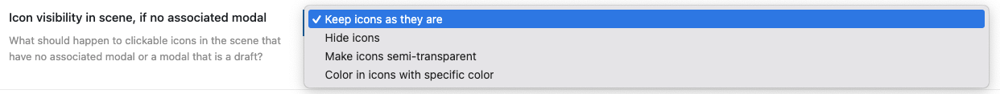 

> Screenshot: Icon visibility option.

**What it does:** Controls whether icons without modals appear.

**When to use:** Perhaps you have many icons and want to do a slow rollout. This will help use

**Required?** Optional.

**Keep icons as they are:** Let the icons on your .svg appear to site visitors. Since your icons are not linked to modals, they will not highlight when the mouse hovers over them.

**Hide icons:** Icons that are not linked to modals will not be seen at all.

**Make icons semi-transparent:** The icons that are not linked to modals will still be seen, but they will be transparent and a "not available" message will appear when the mouse hovers over them.

**Color in icons with specific color:** The icons will appear, but will have a different color on mouse hover. 

&nbsp;
---
&nbsp;
## Table of Contents Style
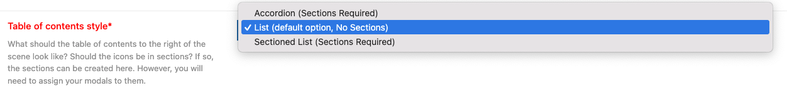  

> Screenshot: Table of contents style.

**What it does:** Controls how the icons (modals) in your .svg file are displayed in the Scene’s table of contents. This option allows for "Sectioned Lists/Accordion" (Sections Required) which have a greater control where you can apply different colors to your .svg icons and put them in named sections (Up to 6 sections). Or, you can use the "List" option, which does not require sections. 

**List (default option, No Sections)**

 - List view will display your icons (modals) alphabetically if no order is set in the modal(s) that are linked to your .svg icons. You only have the option for one hover color for the icons. This is the color that displays when the mouse hovers over the icon. When site visitors view this list it will display the icon's (associated modal's) text to the right of the .svg as clickable links that will open your modals. 

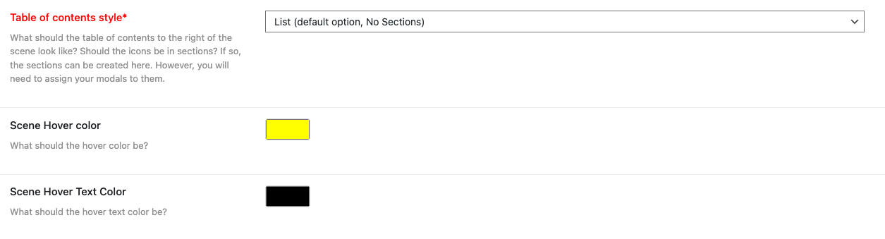  

**Sectioned Lists/Accordion (Sections Required)**

- Sections allow you to put the icons (modals) in your .svg file in to sections (bins, or buckets). When site visitors view these sections they will be displayed to the right of the .svg, and contain your icon's (associated modal's) text as clickable links that will open your modals. 

- In Sectioned Lists/Accordions, if a single hover color is selected in sectioned view, the icons will display alphabetically if no order is set in the modal(s) that are linked to your .svg icons. You only have the option for one hover color for the icons. 

**Single Color Options for All Sections:**

- One Mouse-Over hover color option, and one text color option that governs the display of icons (modals) in your .svg for all sections.

**Required?** Yes, you have to set the Number of Sections and the Section titles at the very least.
    
**Individual Color Options for Each Section:**

- Individual Mouse-Over hover color options, and text color options that governs the display of icons (modals) in your .svg for each section individually.

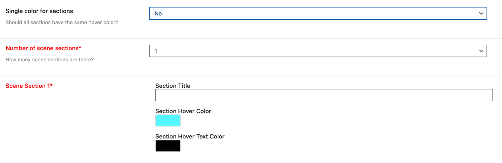

**Required?** Yes, you have to set the Number of Sections and the Section titles at the very least.

&nbsp;
---
&nbsp;
## Preview Scene

> Screenshot: Preview Scene button.

**What it does:** Shows how the Scene will appear.  

---
✅ **Checklist before publishing:**  
- Status = Published  
- SVG infographic displays correctly  
- Links and photos load  
- TOC looks right  
