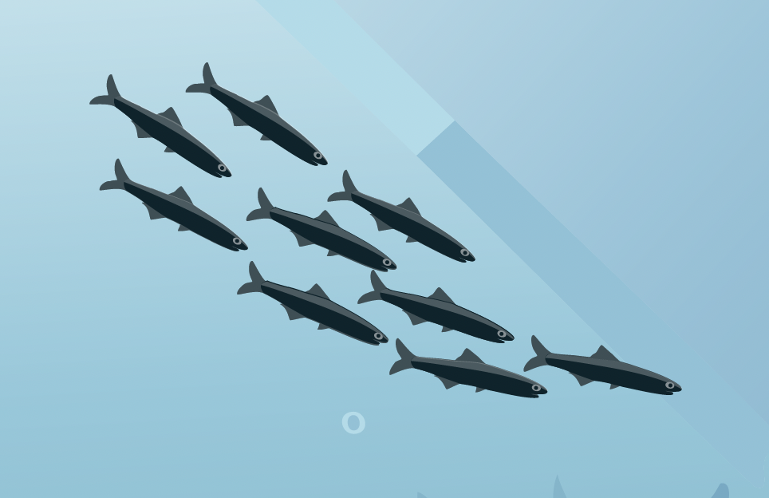
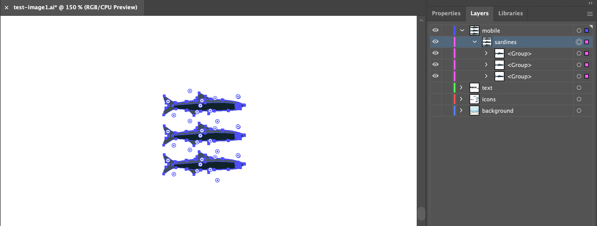
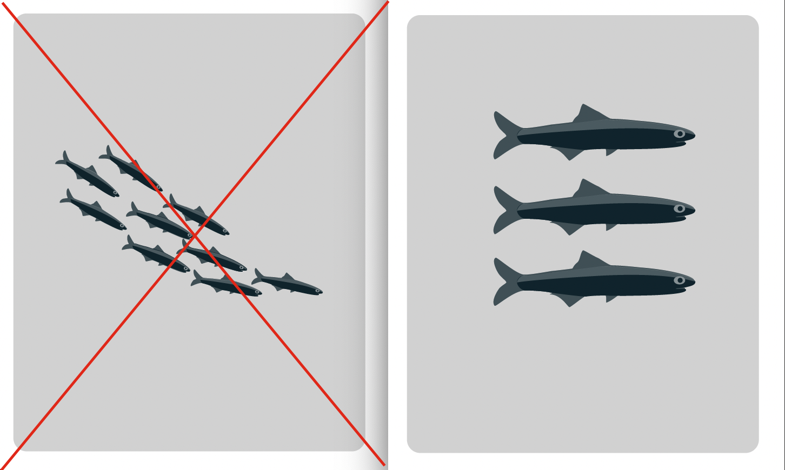

# Chapter 3 | Creating a Java-Script Actionable Image Vector (JAI Vector) #

Java-Script Actionable Image Vectors (JAI Vectors) are vector-based images in an .svg or .ai format that are set up specifically to allow the individual components of the image to be responsive objects that are highlighted when a mouse hovers over them. If clicked, they provide access to either other JAI Vectors, or windows with informative interactive graphs, charts, or other content.

Here we provide instructions for two vector graphics packages: 
- <a href="https://www.adobe.com/products/illustrator.html" target="_blank">Adobe Illustrator (.ai)</a> (requires a paid subscription)
- <a href="https://inkscape.org/" target="_blank">Inkscape (.svg)</a> (free)

For this tutorial, you will need the example folder for the JAI Vectors, which provides a full working example that you can fiddle around with. We will be referring to this folder extensively in this guide and you can download a compressed version [here](https://github.com/ioos/sanctuarywatch/blob/robbiebranch/docs/training_images/JAI_Vectors_chapter_3_files.zip). Just unzip the folder after it has been downloaded.

You can see a working example in action as a finished product <a href="https://marinebon.github.io/infographiqJS/demo.html" target="_blank">here</a>

## 3.1 Adobe Illustrator ##

This guide assumes you have a basic knowledge of using Illustrator (<a href="https://www.adobe.com/learn/illustrator" target="_blank">here is a great series of tutorials</a>). In particular, you’ll need to understand how "layers" work in Illustrator (<a href="https://helpx.adobe.com/illustrator/using/layers.html" target="_blank">and here’s a tutorial for that</a>). 

**NOTE: The methods of implementation vary slightly for desktop view vs mobile view when using "layers". For the sake of continuity, this documentation will consider both as part of a singular workflow for optimizing a .svg graphic for use with JAI Vector in both desktop and mobile settings.**

In the JAI Vector example folder, you will find a file called **"test_image1.ai"**. Open this file in Illustrator and you will see the following:

If you check out the "Layers" tab for the image above, you’ll see that the image is composed of four layers: mobile, text, icons, and background.

If you don't see "Layers", use this access path: *Top Navigation Bar > Windows > Layers*

 - When optimizing a graphic for desktop view only, the required layer order for a JAI Vector is listed below. You'll notice it's missing the "mobile" section as shown in the image. All the following steps will still apply, just skip the sections about "mobile" in the following sections. 
    1. text
    2. icons
    3. background

 - When optimizing a graphic for desktop and mobile, the required layer order of a JAI Vector image is shown in the image below.
    1. text (optional)
    2. icons 
    3. background (optional)
    4. mobile (optional)

    - 

### 3.1.1 Layer organization

1. **text**: 
    
    **This layer is required** and must be called lower case “text”. It contains additional explanatory text and graphics for the image that the JAI Vector can toggle on and off.

    **When creating text, be sure to use a <a href="https://www.w3schools.com/cssref/css_websafe_fonts.php" target="_blank">web-safe font</a> to ensure that your text displays correctly in a web browser.** 

    In the Layers panel, after we click ">" to expand the "text" layer, we can see that this layer contains several elements denoted by <Group>:
     - 

    There are three essential things here:

    A. All of the elements are vector-based (nothing raster-based, raster means image such as .tif, .jpg, or .png). If you happen to have raster-based elements in your image (or are not sure), we strongly recommend that you find a vector version or attempt to convert the raster item to a vector using the <a href="https://helpx.adobe.com/illustrator/using/image-trace.html" target="_blank">image trace tool</a>. Rasters will break the functionality of JAI Vectors and are not meant to be used in these workflows. 

    B. None of the elements within this layer can be named “text”. The following (where one of the elements is named text) is not allowed:
     - 

    C. Double check that the font you select for the text elements displays well in a browser. The default font for Illustrator is often “Myriad Pro”, which does not display well. There are many great alternatives, with one being “Arial”.

2. **icons**: 

    **This layer is required** and contains all of the clickable elements in the image. This layer can be named anything, except for “text” or the name of any other clickable element in the image. We recommend the name "icons" though.

    If you check out the "Layers" panel for “icons”, you’ll see that it contains four sub-layers; octopus, bird, boat, & shark.
     - 

    Each of these sub-layers defines a single clickable component of the image.

     - The names of these sub-layers should not contain spaces, commas, or be called “text”.

     - All elements within the sub-layers should be vector-based and not raster-based. If you happen to have raster-based elements in your image (or are not sure), we you will need to convert them to vector objects using the <a href="https://helpx.adobe.com/illustrator/using/image-trace.html" target="_blank"> image trace tool</a>.

     - Nothing should overlap on top of anything you want to be clickable.

     - Each sub-layer contains all of the elements for a single clickable icon.

     - The elements in the sub-layer, if named, should not have the same name as the sub-layer itself. So, for example, the following won’t work :
         - 

     - Layer names for clickable elements cannot end with a dash followed by a number. For example, "octopus" is an acceptable name, but "octopus-1" and "octopus-4" are not.

    **Adding a background to complex objects to make them easy to highlight:**

     - It might be necessary to add a transparent rectangle or ellipse to the behind complicated objects to ensure that they are able to be locked on to when the mouse hovers over them. This might apply to long slender objects or objects with multiple items, appendages, or branches. In our example, we will use an added layer called "sardines" which is located in layers under "icons > sardines". 

     - Step 1: In the main ArtBoard, we have selected all of the "sardines" (2). You will see the shape tool on the left-side toolbar (1), and the "sardines" layer selected on the right-side Layers panel (3). 
         - 

     - Step 2: Select the "Ellipse tool" from the left-side bar
         - 
     
     - Step 3: While holding right-click with your mouse, drag an ellipse from the top-left of the sardines to the bottom-right. When you first draw the ellipse it may cover your sardines, this is ok and we will fix it in a second. You can edit the size and rotation of the ellipse by hovering your mouse over the anchor points (little squares that are connected by lines) surrounding the ellipse to adjust these settings accordingly to fit completely over the sardines.
         - 
    
     - Step 4: The rectangle you created may cover your icon because it is filled in. If this happens, right click on the rectangle, hover over "arrange" in the expanded menu, and then click on "Send to Back". This will make it the bottom layer of your icon. Be sure to check the layers panel to ensure that you sent it to the back of the "sardines" layer. If your ellipse appears in a different layer, you can simply drag it into the sardines layer and repeat the process of sending it to the back. 
         - 

     - Step 5: To make your rectangle transparent, be sure to click on both the "fill" and "outline" portions of the color indicator on the bottom of your left side tool bar. Once you select either "fill" (#1.1) or "outline" (#1.2) in the top section, click on the white box with the red strike-through in the bottom right (#2) to make it transparent. The "fill" or "outline" will also have this red strike-through when it is applied to them as shown below. 
         - 

    - Step 6: Everything should look like this when you're complete.
        - 

3. **background**:

    This is an optional layer that contains all non-responsive elements of the image. This layer can be called anything (other than “text” or the name of a clickable sub-layer). It is ignored by the JAI Vectors Javascript. We recommend calling it "background" though.

4. **mobile**: 
     - This layer is optional. However, when viewing the same webpage on your desktop (or laptop) computer compared to a mobile device, you may have noticed that the area and orientation of the screen shifts from landscape (like your TV) to portrait (like your mobile device). This shift causes the icons from your JAI Vector scene to be displayed in rows that are 3 across from top left to bottom right in with each of the graphics form the "icons" layer displayed inside of a grey rectangular button. 

     - Also, it is important to note that the layers from "icons" are automatically applied to the mobile format. Meaning you don't have to create them separately to for them to be displayed in mobile view. Only if an icon contains multiple components, or is an odd shape which is too wide or long, is it recommended to use this layer to create a "mobile" version of that specific icon. Put more simply, you only have to use this layer if you have icons that would need to be optimized for mobile view, with a different version of the icon than the one that is in the "icons" layer. 

     - Within the mobile layer, all icon names should have the suffix "-mobile" added to them. For example, let's say we have an icon called "coral-reefs" within a svg that has an alternate view for mobile. Within the mobile layer, the relevant layer should be called "coral-reefs-mobile". 

     -  Below is an example of what your icons might look like when displayed in mobile view:
     - 
     
     **How to create a mobile icon:**

     - For this example, we are going to show you how to create the "sardines" sublayer that is currently under the "mobile" layer (Top Navigation Bar > Window > Layers > mobile). The "sardines" sublayer under the "icons" layer, as seen below is clunky and would not make a good mobile icon. Therefore, we are going to re-imagine it in a format that would suit a mobile button by placing it inside of the "mobile" layer. To avoid confusion, you can turn off the existing "mobile > sardines" layer by clicking the right-arrow next to "mobile" to expand the layer, then clicking on the eye ball icon to the left of the sublayer named "sardines" that is nested under "mobile".
     - 
     
     - Step 1: Click on the "mobile" layer. In the top-right click the three stacked lines to access the layers menu. Then click on "New Sublayer" in the dropdown menu. You can also create the top level "mobile" layer here as needed by selecting "New Layer" instead. 
     - 
        
     - Step 2: In the dialog box that appears go ahead and give your new sublayer a name. For this example, we have just created a new "mobile" sublayer called "sardines". Click "OK" to finish.
     -  

     - Step 3: Your new sublayer names "sardines" will now appear nested inside the "mobile" layer. With "sardines" selected in the layers panel, It is then possible to paste vector items and artwork inside of it (To be sure it is a vector object, See 3.1.2 Dealing with raster-based elements below). For this example we selected the original "sardines" layer  under "icons" then copied a single sardine using "CTRL + C", then pasted it 3 times using "CTRL + V" inside of the of "sardines" layer under "mobile". We did this three times and repositioned each individual sardine to stack them vertically. The layer nesting (hierarchical structure of the layers and sublayers) should reflect how the "mobile" layer is displayed in the example below. 
     - 
    
     - Step 4: Now, when being used on your web page, the "sardines" layer will appear as shown in the "mobile" layer and not as previously as shown in the layer graphic meant for a desktop computer. The example below allows for you to see the two potential icons next to each other. The "sardines" icon in the top-left is more clear and easy to understand. The top-center "sardines" icon to the right of it could be any small fish, and is more ambiguous to interpret visually.  
     - 

    
### 3.1.2 Dealing with raster-based elements

How do I tell if something is raster or vector-based?

One dead give-away that an image is raster-based is if the file is saved in a raster-based file format. You can determine the file format of a file by checking out the last few characters of the file name (the file extension). Some common raster-based file formats are (with their extensions):

    .gif (Graphic Interchange Format)

    .jpg or .jpeg (Joint Photographic Experts Group)

    .png (Portable Network Graphics)

    .psd (PhotoShop Document)

    .tiff (Tag Image File Format)

Checking the file extension isn’t a fool-proof system though. Just because an image is saved in some other format than those above doesn’t mean that it isn’t a raster-based image. So, how can you know for sure? Well, open the image up in Illustrator and take a close look at the Layer panel. If the image is raster-based, it will say <Image> under the appropriate layer (be sure to click the arrow just to the left of the layer name to see what it contains). See below for an example:

**Converting a raster to a vector**

If you have some raster-based elements that you’d like to include in your JAI Vectors image, Illustrator has got you covered. You’ll just need to convert those elements into vectors and here’s how to do that:

1. Select image (from Layers; or Select All from menu).

 - 

2. From the menu, select Object > Image Trace > Make and Expand.

 - 

3. Delete (trash icon in Layers menu) or Unite/Merge (in Pathfinder menu) the selected layers until you achieve the desired simplified icon result.

 - 

### 3.1.3 Saving the image

To be used by JAI Vectors, the file must be exported in svg format. To do so:

1. From the menu, click: File > Export > Export As.
2. In the following screen, select svg format. Be sure to click “Use ArtBoards”.
3. In the final screen that pops up, be sure to set Object IDs to “Layer Names”, as follows:

 - 

4. You can hit the little "globe" button in the bottom row to display a temp version of your .svg in a web browser.
5. If your artwork is not displaying correctly or is running off the side of the page, try adjusting the "Decimal" setting to a higher number such as 3,4,5, or 6. The try hitting the globe button again to view the updated temp .svg in your browser. 
6. The default for Illustrator is to add an “01” to your svg file name (so, “example.svg” becomes “example01.svg”). Change the file name back to your desired choice if needed.

## 3.2 Inkscape

This guide assumes you have a basic knowledge of using Inkscape <a href="https://inkscape.org/learn/tutorials/" target="_blank"> here is a great series of tutorials</a>. In particular, you’ll need to understand how layers work in Inkscape <a href="https://inkscape.org/~JurgenG/%E2%98%85layers-objects-and-paths" target="_blank"> and here’s a tutorial for that</a>.

In the JAI Vectors example folder, you’ll find a file called test-image1.svg. Open this file in Inkscape and you’ll see the following:

- You can open up the "Layers" panel by clicking on the stacked icon in the top navigation bar. It's highlighted in red. 

If you check out the Layers panel for the image, you’ll see the following:

### 3.2.1 Layer organization

1. **text**:

    **This layer is required** and must be called lower case “text”. It contains additional explanatory text and graphics for the image that the JAI Vector can toggle on and off.

    **When creating text, be sure to use a <a href="https://www.w3schools.com/cssref/css_websafe_fonts.php" target="_blank">web-safe font</a> to ensure that your text displays correctly in a web browser.** 

    There are three essential things here:

    A. All of the elements are vector-based (nothing raster-based, raster means image such as .tif, .jpg, or .png). If you happen to have raster-based elements in your image (or are not sure), we strongly recommend that you find a vector version or attempt to convert the raster item to a vector. Rasters will break the functionality of JAI Vectors and are not meant to be used in these workflows. 

    B. None of the elements within this layer can be named “text”. In this case, it doesn't really apply because there are no sub-layers for "text". but, if you did have them this would be the case.

    C. Double check that the font you select for the text elements displays well in a browser. The default font for Illustrator is often “Myriad Pro”, which does not display well. There are many great alternatives, with one being “Arial”.

2. **icons**:

    **This layer is required** and contains all of the clickable elements in the image. This layer can be named anything, except for “text” or the name of any clickable element in the image. If you check out the Layers panel for “icons” (see image just above), you’ll see that it contains four sub-layers (chart examples 1 through 6). Each of these sub-layers defines a single clickable component of the image.

    Each of these sub-layers defines a single clickable component of the image.

     - The names of these sub-layers should not contain spaces, commas, or be called “text”.

     - All elements within the sub-layers should be vector-based and not raster-based. If you happen to have raster-based elements in your image (or are not sure), we you will need to convert them to vector objects.

     - Nothing should overlap on top of anything you want to be clickable.

     - Each sub-layer contains all of the elements for a single clickable icon.

     - The elements in the sub-layer, if named, should not have the same name as the sub-layer itself. For   example, if a clickable sub-layer within the icons layer is intended to be called "whales", "whales" can only occur once as a layer name in the entire Illustrator file.

     - Layer names for clickable elements cannot end with a dash followed by a number. For example, "whales" is an acceptable name, but "whales-1" and "whales-4" are not.

    **Adding a background to complex objects to make them easy to highlight:**

     It might be necessary to add a transparent white rectangle or ellipse to the behind complicated objects to ensure that they are able to be locked on to when the mouse hovers over them. This might apply to long slender objects or objects with multiple items, appendages, or branches.

     - See this section in the Illustrator instructions above for "3.icons > Adding a background to complex objects to make them easy to highlight" for a general outline of what needs to be done in Inkscape as well. The exact method will differ in Inkscape.

3. **background**:

    Another optional layer that contains all non-responsive elements of the image. This layer can be called anything (other than “text” or the name of a clickable layer). It is ignored by the JAI Vectors Javascript.

4. **mobile**:

     - This layer is optional. However, when viewing the same webpage on your desktop (or laptop) computer compared to a mobile device, you may have noticed that the area and orientation of the screen shifts from landscape (like your TV) to portrait (like your mobile device). This shift causes the icons from your JAI Vector scene to be displayed in rows that are 3 across from top left to bottom right in with each of the graphics form the "icons" layer displayed inside of a grey rectangular button.

     - Within the mobile layer, all icon names should have the suffix "-mobile" added to them. For example, let's say we have an icon called "coral-reefs" within a svg that has an alternate view for mobile. Within the mobile layer, the relevant layer should be called "coral-reefs-mobile". 

     - Also, it is important to note that the layers from "icons" are automatically applied to the mobile format. Meaning you don't have to create them separately to for them to be displayed in mobile view. Only if an icon contains multiple components, or is an odd shape which is too wide or long, is it recommended to use this layer to create a "mobile" version of that specific icon. Put more simply, you only have to use this layer if you have icons that would need to be optimized for mobile view, with a different version of the icon than the one that is in the "icons" layer. 

     -  Below is an example of what your icons might look like when displayed in mobile view:
     - 

     - See this section in the Illustrator instructions above for "1.mobile > How to create a mobile icon" for a general outline of what needs to be done in Inkscape as well. The exact method will differ in Inkscape.

### 3.2.2 Editing the layer XML

In order for the JAI Vectors image to behave properly, you will need to edit the XML for the image. In order to do so, you’ll need to have two panels visible:

1. Layers (to show from Menu, Layer > Layers…)

2. XML Editor (to show from Menu, Edit > XML Editor…)

Let’s zoom in on these panels for the image inkscape_example.svg:

For each of your layers:

1. Click the associated entry in the XML Editor (hint: the “inkscape:label” will match the layer name).
2. In the box to the right, change the id to match the layer name.
3. Select the “text” layer in the XML Editor. In the box to the right, click the red X by “display: inline” (thereby deleting that row). Note: in the example file inkscape_example.svg, the “display: inline” line has already been deleted.

### 3.2.3 Dealing with raster-based elements

How do I tell if something is raster or vector-based?

One dead give-away that an image is raster-based is if the file is saved in a raster-based file format. You can determine the file format of a file by checking out the last few characters of the file name (the file extension). Some common raster-based file formats are (with their extensions):

    - .gif (Graphic Interchange Format)

    - .jpg or .jpeg (Joint Photographic Experts Group)

    - .png (Portable Network Graphics)

    - .psd (PhotoShop Document)

    - .tiff (Tag Image File Format)

Checking the file extension isn’t a fool-proof system though. Just because an image is saved in some other format than those above doesn’t mean that it isn’t a raster-based image. So, how can you know for sure? Well, open the image up in Inkscape and right click on it. If in the options you see “Image Properties…”, you’ve got a raster-based image on your hands (see image below).

Converting a raster to a vector

If you have some raster-based elements that you’d like to include in your JAI Vectors image, Inkscape has got you covered. You’ll just need to convert those elements into vectors and <a href="https://inkscape.org/doc/tutorials/tracing/tutorial-tracing.html" target="_blank"> here’s a tutorial on how to do that</a>.

### 3.2.4 Saving the image

To be used by JAI Vectors, the file must be exported in svg format. Good news! Inkscape’s native file format is already svg. When you save the image, just be sure to save it in the format “Inkscape SVG (#.svg)”.
